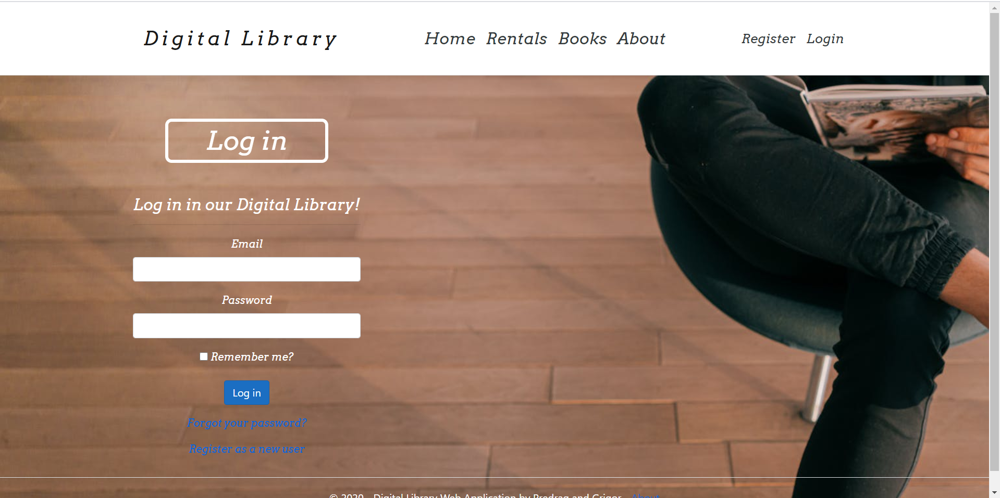

# Digital Library

## Summary
Digital library is a Web Application that stores a database of very larga variety of Books and makes renting part easy for both clients and library workers.

It offers:

- The big collection of books that a customer can rent.

- All the rentals that occured and the time they were placed in.

- As you could see, it offers editing, deleting and many more options to the users.

- Also, it offers authorization and authentication

- We have also done the API.

- Also, we have made the Android application for the mobile users!

# FRI Ljubljana 2020/2021
# Predrag Djindjic 63180362
# Grigor Ristov 63180343
